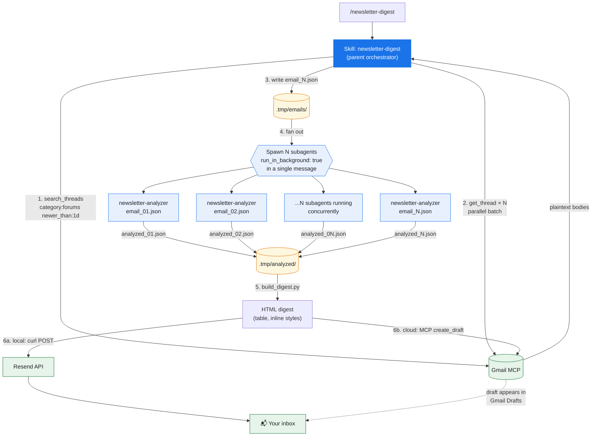

# Claude Newsletter Digest

> Daily Gmail newsletter digest powered by Claude — fetched, analyzed in parallel by per-email subagents, rendered as a clean HTML table, and delivered to your inbox via Resend (local runs) or as a Gmail draft (scheduled cloud runs).

Every run, this workflow:

1. Pulls the last 24 hours of newsletters from your Gmail **Forum** tab (via the Claude.ai Gmail MCP — no OAuth tokens to manage).
2. Writes each email to disk as JSON.
3. Spawns **one `newsletter-analyzer` subagent per email, all in parallel**, each classifying the piece (argument, roundup, profile, research, interview, briefing) and producing an archetype-appropriate structured summary.
4. Builds a single HTML digest table from every subagent's output.
5. Delivers the digest — **Resend API** when running locally, **Gmail `create_draft`** when running in the Anthropic sandbox where `api.resend.com` is blocked.

---

## What the output looks like

A 5-column table, one row per newsletter:

| Sender | Summary | Key Statistics | 🔗 | ✉️ |
|--------|---------|----------------|----|----|
| SemiAnalysis | 📊 **Research:** GPU Cluster TCO — gold-tier is 5–15% cheaper than silver-tier on training; gap vanishes on inference | 8 stats incl. "Goodput expense 6.14% / 10.53% / 20.91%" | 🔗 | ✉️ |
| The Information | 📰 **News:** OpenAI image model, Meta layoffs, Anthropic $800B valuation interest... | 15 figures cited | 🔗 | ✉️ |
| Noahpinion | 💬 **Argument:** "Industrial policy" is too broad a category — FDI differs fundamentally from subsidies | — | 🔗 | ✉️ |

The 🔗 column jumps to the article's web version; the ✉️ column opens the message in Gmail.

---

## Architecture



**Why parallel subagents?** Each newsletter is independent. Spawning N subagents in a single message (with `run_in_background: true`) cuts analysis time from *sum of all emails* to *slowest single email* — typically 15–30 seconds regardless of inbox size.

**Why a dedicated subagent instead of analyzing in the parent?** Each analyzer is a Sonnet instance with only `Read` and `Write` tools. Small, isolated contexts mean better summarization quality, and they can't accidentally touch the parent's state.

**Why a Python `build_digest.py`?** Generating 10–20+ rows of inline-styled HTML directly from the orchestrator would blow past reasonable response sizes. Offloading rendering to a deterministic script keeps the parent turn short and the HTML consistent every run.

**Why two delivery paths?** Local `/newsletter-digest` runs can `curl` Resend directly. The Anthropic scheduled-trigger sandbox has a tight egress allowlist that blocks `api.resend.com` — but the Gmail MCP host is always allowlisted, so the skill falls back to `create_draft` and the digest lands in Gmail Drafts instead. SKILL.md auto-detects which path to take based on whether a `.env` file is present.

---

## Repo layout

```
claude-newsletter-digest.v2/
├── .claude/
│   ├── agents/
│   │   └── newsletter-analyzer.md          ← subagent definition (archetype templates)
│   └── skills/
│       └── newsletter-digest/
│           ├── SKILL.md                    ← orchestration instructions (both 7a & 7b paths)
│           └── scripts/
│               ├── build_digest.py         ← renders analyzed JSON → HTML
│               └── digest_template.html    ← visual reference
├── .env.example                            ← Resend creds template (copy to .env)
├── .gitignore                              ← blocks .env, .tmp/, token files
└── README.md
```

---

## Prerequisites

| Requirement | How to get it |
|-------------|---------------|
| Claude Code (CLI, desktop, or web) | [claude.ai/code](https://claude.ai/code) |
| Gmail MCP connected inside Claude | Claude.ai → Settings → Integrations → Gmail |
| Resend account (free tier: 3,000 emails/month) — *local path only* | [resend.com](https://resend.com) |

No Google OAuth client, no `credentials.json`, no `token_*.json`. The Claude.ai Gmail integration handles auth for you.

---

## Setup — Local use

### 1. Clone this repo into (or alongside) your Claude Code workspace

```bash
git clone https://github.com/xj-2045/claude-newsletter-digest.v2.git
cd claude-newsletter-digest.v2
```

### 2. Copy `.claude/` into your Claude Code workspace root

```bash
cp -R .claude /path/to/your/workspace/
```

Claude Code auto-discovers the skill and agent on next startup.

### 3. Create `.env` with Resend credentials

```bash
cp .env.example /path/to/your/workspace/.env
# then edit and fill in your keys
```

Values you need:

- `RESEND_API_KEY` — from resend.com → API Keys
- `RESEND_FROM` — `onboarding@resend.dev` works immediately for testing. For a branded sender, verify a domain at resend.com/domains.
- `RESEND_TO` — where the digest lands (usually your own inbox).

### 4. Run it

In Claude Code, type:

```
/newsletter-digest
```

On the first run, Claude will ask for permission for each tool (Gmail MCP reads, Bash `curl`, etc.). Approve, and the digest lands in your `RESEND_TO` inbox in ~30 seconds.

---

## Setup — Scheduled cloud trigger

The Anthropic scheduled-trigger environment has no `.env` file and blocks `api.resend.com`. In that environment the skill auto-selects the Gmail-draft path.

1. Create a scheduled trigger at claude.ai/code/scheduled.
2. Attach the Gmail MCP connector to it.
3. Point the trigger at this repo (`sources` → `github.com/xj-2045/claude-newsletter-digest.v2`).
4. In the trigger prompt, invoke `/newsletter-digest`.

The skill detects the missing `.env` and routes output through `mcp__claude_ai_Gmail__create_draft`. Your digest shows up in Gmail Drafts ready to hit Send (or to forward elsewhere).

---

## How the archetype classifier works

The `newsletter-analyzer` subagent chooses **one** archetype per email, then applies that archetype's template. This is the key to readable summaries — a weekly bank-earnings roundup deserves a different shape than an editorial arguing a thesis.

| Archetype | Shape | Typical senders |
|-----------|-------|-----------------|
| **argument** 💬 | Claim / Against / Key evidence | Editorials, opinion substacks |
| **roundup** 🏭 | One bullet per company or item | Industry weeklies, earnings recaps |
| **profile** 👤 | Who / Achievement / Striking detail | Founder features, company deep dives |
| **research** 📊 | Finding / Method / Implication | Data reports, surveys, benchmarks |
| **interview** 🎤 | Who / Thesis / Surprising claim | Podcast summaries, Q&As |
| **briefing** 📰 | One bullet per story | News briefings, link roundups |

Templates and rules live in [`.claude/agents/newsletter-analyzer.md`](.claude/agents/newsletter-analyzer.md).

---

## Performance

| Stage | Typical duration |
|-------|------------------|
| MCP Gmail fetch (search + parallel `get_thread`) | 5–15 s |
| Parallel subagent analysis (N emails) | 15–30 s (bottlenecked by slowest email) |
| HTML build + delivery | 1–2 s (Resend) · 3–5 s (Gmail draft) |
| **Total** for 10–20 newsletters | **~30–50 s** |

---

## Troubleshooting

| Symptom | Likely cause |
|---------|--------------|
| `CERTIFICATE_VERIFY_FAILED` on Resend | Using Python `urllib` instead of `curl`. The skill uses `curl` for a reason — macOS python.org builds ship without a CA bundle. |
| `403 validation_error: from is not verified` from Resend | Use `onboarding@resend.dev` for testing, or verify a domain at resend.com/domains. |
| `403 Host not in allowlist` for `api.resend.com` | You're running in the Anthropic sandbox. Remove the `.env` file (or let the skill's path-detect handle it) — Step 7b will deliver via Gmail draft instead. |
| Empty digest despite new emails | Newsletters aren't going to Gmail's Forum tab. Check `category:forums newer_than:1d` in Gmail search. |
| `create_draft` fails with "exceeds maximum allowed tokens" | The HTML payload is too large to round-trip through `Read`. SKILL.md Step 7b keeps the HTML in a Python variable and passes it directly to the MCP tool — don't Write-then-Read. |
